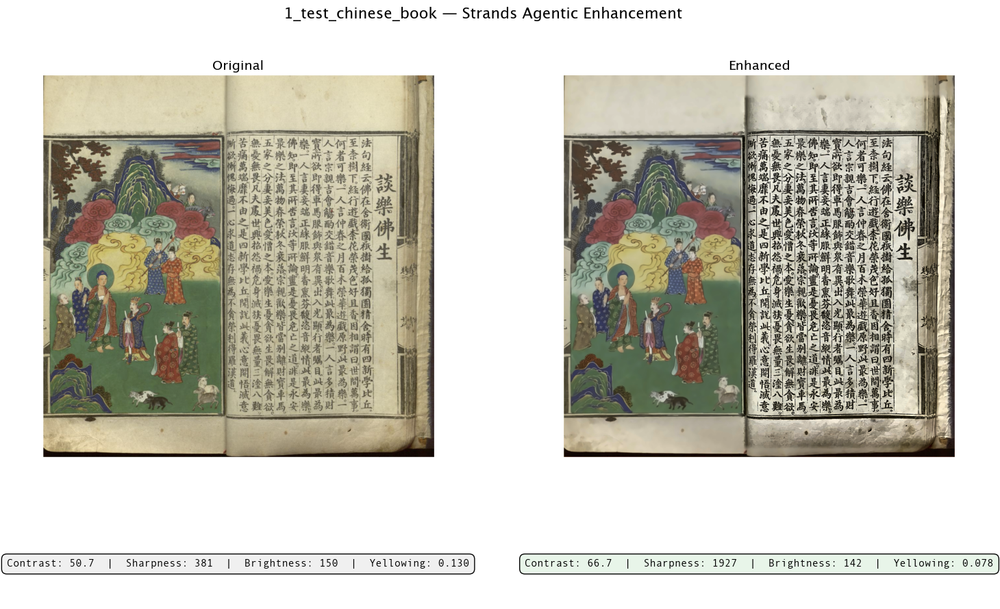
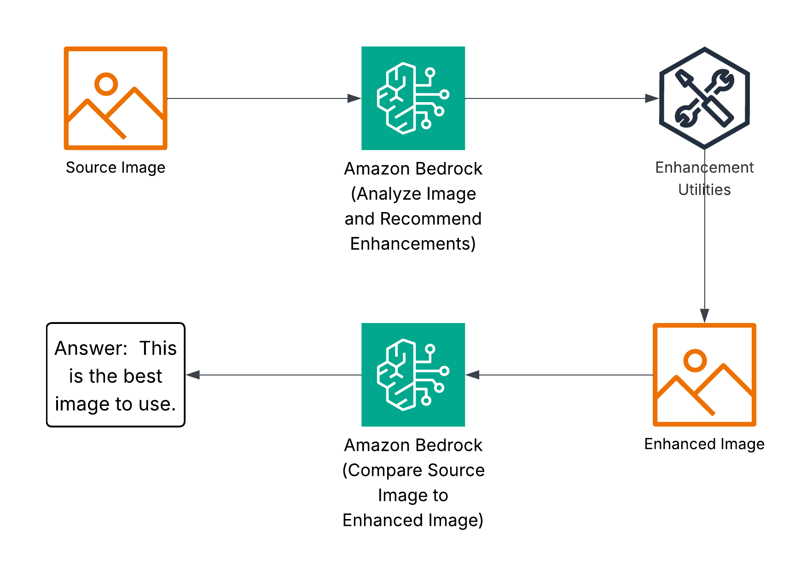

# Agentic Image Enhancement

Vision LLM-driven document image enhancement powered by [Strands Agents](https://strandsagents.com), with targeted OpenCV operations and automated quality comparison.

A Strands agent (Claude on Bedrock) runs an iterative enhancement loop — it examines a document image, prescribes targeted operations, executes them via tools, compares the result against the original, and decides whether to refine further or finish. Python-based tools (OpenCV, Pillow) do the actual pixel manipulation.

## Sample Output



## Architecture



## Quick Start

### 1. Install uv

```bash
# macOS / Linux
curl -LsSf https://astral.sh/uv/install.sh | sh

# Or with Homebrew
brew install uv
```

### 2. Clone and set up

```bash
git clone <repo-url>
cd agentic-image-enhancement

# Create venv and install all deps (notebook + bedrock extras)
uv sync --extra notebook --extra bedrock
```

This creates a `.venv/` with Python 3.12 (pinned in `.python-version`) and installs everything you need.

### 3. Configure AWS credentials

Copy the example env file and fill in your AWS config:

```bash
cp .env.example .env
```

Edit `.env`:

```
AWS_PROFILE=your-profile-name   # Optional — omit if using SSO, federated, or exported creds
AWS_REGION=your-region           # Optional — resolved from your AWS profile if not set
```

Credentials are resolved through the standard AWS credential chain (SSO, environment variables, `~/.aws/credentials`, instance roles, etc.). If `AWS_PROFILE` is set, it will be passed to the boto3 session; otherwise boto3 picks up whatever credentials are active in your environment.

### 4. Run the notebook

```bash
uv run jupyter notebook
```

Then open `strands_agentic_image_enhancer.ipynb` from the Jupyter file browser.

Or alternatively open in your IDE of your choice that supports Jupyter Notebooks.  [Example: Amazon Kiro](https://www.kiro.com)


## Project Structure

```
├── strands_agentic_image_enhancer.ipynb   # Main notebook — Strands agentic loop
├── tools/
│   └── enhancement_tools.py       # OpenCV/Pillow operations (the agent's tools)
├── utils/
│   └── visualization_utilities.py # Side-by-side comparison displays
├── inputs/                        # Drop test images here
├── outputs/enhanced_output/       # Enhanced results saved here
├── pyproject.toml                 # Dependencies and project metadata
├── .python-version                # Pinned Python version (3.12)
└── .env.example                   # Template for AWS config
```

## How It Works

1. **Assessment**: The Strands agent receives the image and examines it for issues (contrast, noise, skew, color cast, etc.)
2. **Tool Use**: The agent calls `enhance_image` with a sequence of operations at specific intensities, optionally targeting regions
3. **Execution**: Operations are applied sequentially via OpenCV/Pillow
4. **Comparison**: The agent calls `compare_with_original` to evaluate metrics (contrast, sharpness, etc.)
5. **Iterate or Finish**: Based on comparison feedback, the agent may reset and retry with different operations, or call `finish_enhancement` to declare a winner — up to a configurable max iterations (default: 2)

## Available Operations

| Operation            | Description                                 |
| -------------------- | ------------------------------------------- |
| `contrast`           | CLAHE local contrast enhancement            |
| `brightness`         | Perceptual brightness adjustment            |
| `sharpen`            | Unsharp mask sharpening                     |
| `denoise`            | Non-local means denoising (edge-preserving) |
| `deskew`             | Auto-rotation to correct document skew      |
| `white_balance`      | Remove yellowing / color cast               |
| `equalize_histogram` | Global tonal spread (aggressive)            |
| `auto_crop`          | Detect and crop to document boundaries      |
| `invert`             | Flip dark/light (for negatives)             |
| `remove_stains`      | Reduce foxing, age spots, uneven background |

## License

MIT
